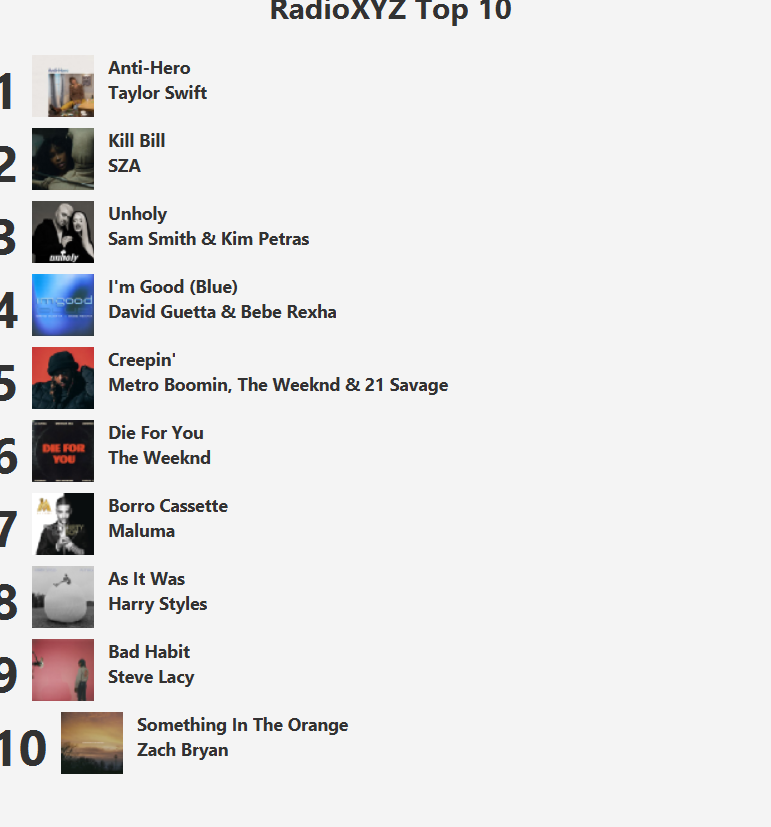

# Taller01-Ramas
<<<<<<< HEAD
# Cambios sección B
# Lider:
# Cambio de titulo a "Top 10 de canciones - Actualizado"
=======
Captura del cambio generado en la rama orden

# Cambios Sección B 
# Integrante 3
# Cambio de formato "Artista - Canción"

# Cambios Integrante 4 
## Cambio de nombre e imagen de cancion 

>>>>>>> de043c3cb32993048810a7ccd62239a3bad750de
